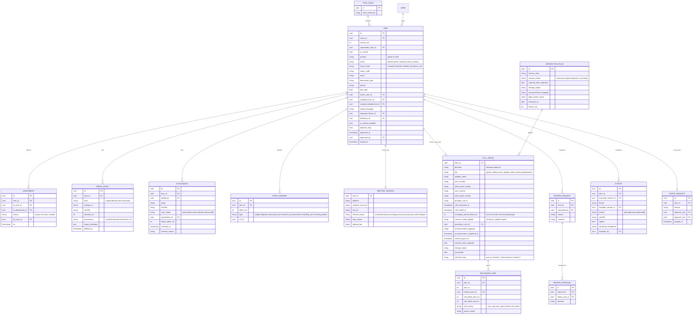
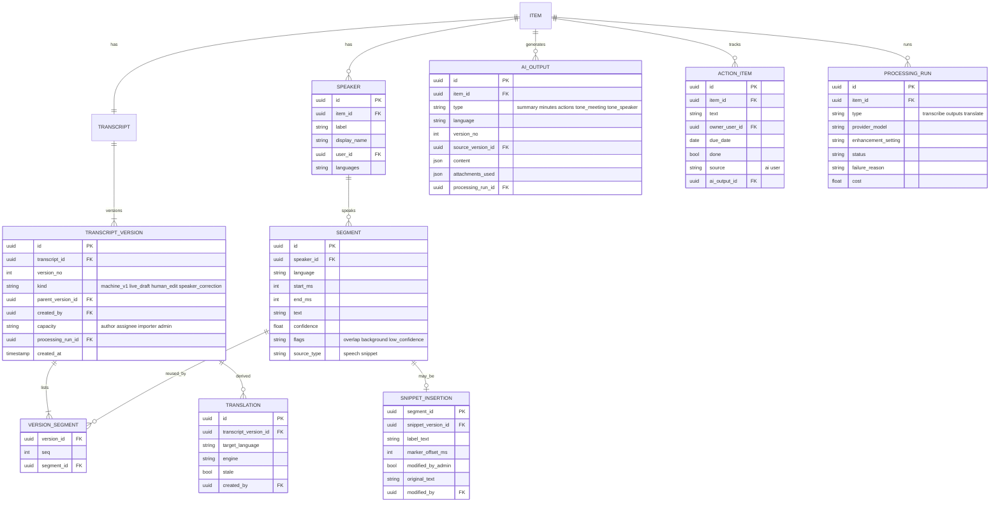
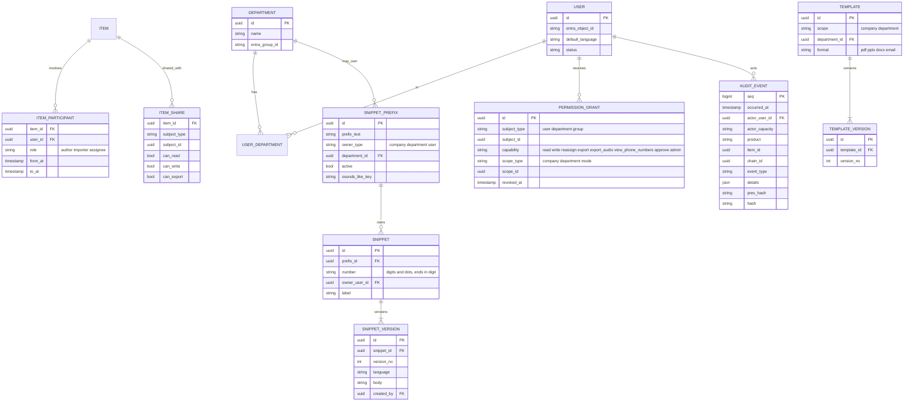

# Data model: items, transcripts and permissions

**Scope:** Speak, Meet and Widget on one shared model | **Status:** Proposed, for review

## Principles

1. **One item model for Speak and Meet.** A mode and a product tag distinguish them. Statuses are stored once as internal codes, and each mode maps them to its own labels.
2. **Approved records never change.** Reopening creates a new linked item version. The original stays locked.
3. **Transcripts are immutable segments plus versions.** An edit creates a new segment and a new version, never an overwrite. Machine version 1 always survives.
4. **Original media is write-once and hashed.** Filtered copies are separate records and are deleted after approval.
5. **Audit is append-only and hash-chained.** Widget writes to it without content, and has no content tables at all.
6. **Locks beat grants.** An admin grant can add a capability, but it can never override the approval lock.

## 1. Items and workflow

**Status codes and labels.** The item stores one internal code, and a mapping table supplies each mode's label.

| Internal code | Dictate | Speech | Meeting | Meet |
|---|---|---|---|---|
| `draft` | Draft | Draft | none | none |
| `converting` | Converting | progress tag | progress tag | Processing |
| `conversion_failed` | Conversion Failed | Conversion Failed | Conversion Failed | Join Failed (join stage) |
| `with_author` | With Author | Speech to Text | With Author (in-app only) | none |
| `with_importer` | none | none | Imported | none |
| `awaiting_assignee` | Awaiting Assignee | Awaiting Assignee | Awaiting Assignee | none |
| `with_assignee` | With Assignee | With Assignee | With Assignee | none |
| `completed` | Completed | Completed | Completed | Ready |
| `purged` | none | none | Purged | none |

Telephone calls recorded by the system use `with_author` like any in-app Meeting recording. Telephone recordings supplied as files use `with_importer`, so the two never mix.

Self-assigned means `assigned_user_id = owner_user_id`. The tag is derived and not stored. Outstanding Tasks (Speech) is a query, not a status.

## 2. Transcripts and AI outputs

**How editing works.** Editing one passage creates one new `SEGMENT` row and a new `TRANSCRIPT_VERSION` whose `VERSION_SEGMENT` list points at the unchanged old segments plus the new one. Comparing or restoring versions is just comparing lists. Machine version 1 is never modified, and segment timestamps always point into the original media.

**Speaker corrections** (rename, merge, split, reassign) are versions of kind `speaker_correction`. They are also audit events.

**Snippets in the transcript** are segments with `source_type = snippet`. Admin edits change the insertion's text for this document only, keep `original_text` for the strike-through view, and never touch the library snippet. At approval the display shows the final text with a "modified by admin" flag.

**AI outputs** are rows, so regenerating adds a version and keeps the old one. Each records its source transcript version, language, attachments used and model run. Tone analysis never reads attachments or snippet segments.

**Translations** are derived from a specific transcript version. A new version marks them stale. They are always labelled as machine translation.

## 3. Access, libraries and audit

**Effective permissions.** Evaluate in this order and stop at the first deny:
1. **Lock.** A completed item is read-only for everyone. Only a new reopened version can change.
2. **Role on this item.** The author or importer has read/write until approval. The assignee has read/write on the transcript and read-only on audio. A Meet owner has full access and shares rights through `ITEM_SHARE`.
3. **Grants.** Add capabilities such as re-assign, export or audio download. Export and audio download are separate capabilities. A grant can remove a right as well as add one.
4. **Otherwise deny.**

Admins act through grants (re-assign, approve, remove attachments, edit an inserted snippet in one document), and each use is audited.

## Telephone calls (Meeting mode)

A recorded telephone call is an `ITEM` with `product = speak`, `mode = meeting`, `source_kind = phone_call`, and one `CALL_DETAIL` row. It follows the Meeting rules: the audio is never edited, the raw original is stored and hashed, and a filtered copy is used only for transcription.

**Per-call recording.** Recording is never automatic. An item exists only if the user switched recording on for that call and the consent step completed. A call that is never recorded creates no item, transcript or call detail.

**Parts and gaps.** A call can have several `RECORDING_PART` rows, each with its own `MEDIA_ASSET`, offsets into the call, and end reason. A pause, a failure or a restart ends one part and starts the next, so gaps are explicit and visible on the timeline. `recording_started_offset_ms` records how far into the call recording began. `incomplete` is set when a part ended through failure.

**Consent and rules.** `JURISDICTION_RULE` holds one current row per country, versioned, with the consent mode, whether recording continues after an objection, the storage region, the announcement language and the Legal review status. For each call the stricter rule of the user's country and the other party's country is applied, and the rule version actually used is stored on `CALL_DETAIL`, so an old call always shows which rule applied. Recording starts only after `announcement_completed_at` (or `consent_given_at` for explicit mode) is set.

**Failures.** If recording cannot start, no item is created. A content-free audit event records the attempt, a reason code and the user's choice (continue without recording, retry, or end call). Continuing never bypasses the consent step.

**Diarization.** `channel_map` records which party is on which channel. Where channels are separate, speaker labels come from the channel ("You" and "Other party"), and normal diarization is applied only within a channel that carries several people.

**Phone numbers.** Numbers in `CALL_DETAIL` are personal data. They are hidden unless the user holds the `view_phone_numbers` capability, and views are audited. Exports omit them unless the template and the user's rights include them.

**Storage region.** `storage_region` is set at call start from the rule. Media for that call is written only to that region, and the processing queue routes work to services in the same region.

## Integrity rules enforced in the database

- Segments, transcript versions, media hashes and audit events have no update or delete permission for the application.
- Reopen approvals need two different admins, and neither can be the requester.
- Snippet labels must match the number rule (digits and dots, ending in a digit). Prefixes are unique per owner. The reserved User prefix is only valid for user-owned snippets, and uniqueness there is per user.
- Retired prefixes block new snippets but leave existing ones and past documents intact.
- Every insertion stores the snippet version used, so later library edits never change old documents.
- Approved items reject changes by trigger, and the only route to change is a reopen that creates a new `ITEM`.
- Audit events chain by hash. An independent job verifies the chain and the exports to immutable storage.
- A `phone_call` item cannot be created without a completed consent step recorded on its `CALL_DETAIL`, and its `RECORDING_PART` rows are write-once like other media.
- Jurisdiction rules are versioned, never edited in place, and a call keeps a reference to the version it used.
- Phone numbers are readable only through the `view_phone_numbers` capability, and every read is audited.
- Media for a call must be stored in the region named on its `CALL_DETAIL`.

## Widget

Widget has no item, transcript or media tables. It writes `AUDIT_EVENT` rows with `product = widget` and no `item_id`. Two small tables sit beside them: `WIDGET_SESSION` (user, device, app or site, start, stop) and `WIDGET_POLICY` (blocked apps and sites, set by admins). A schema check rejects any Widget event whose details contain text or file names.

## Retention and purge

A `RETENTION_POLICY` per scope and media type (original audio, video, filtered copy, transcript, attachments) drives lifecycle rules. A purge deletes content, keeps the item row as a tombstone (reference, dates, who, why), and writes an audit event.

## Open points

1. **Multiple authors or organisers.** Meet items with several attendees are modelled as one item plus shares. Confirm that is enough.
2. **Action items in Speak.** They share one table with Meet. Confirm Speak needs the same add/edit rights.
3. **Voice enrolment.** Not modelled yet. It needs a separate consent and biometric-data design.
4. **Row-level security.** Whether to enforce the permission order in the database as well as in the application.
5. **Tier 2 carrier adapters.** The model has `tier` and `adapter_name`, but the ingestion contract (what each carrier delivers, and any tamper-evidence it supplies) is defined per adapter later.
6. **Retention for calls.** Retention periods for call recordings and for `CALL_DETAIL` (especially phone numbers) need setting in the retention policy.
7. **Objection handling on calls.** Where a country does not allow recording to continue after an objection, confirm the exact behaviour: stop the part, end the call, or notify the user only.
